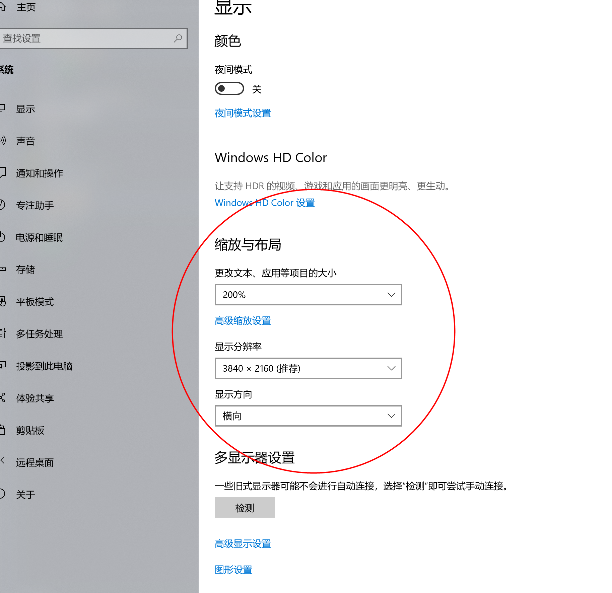

简单粗暴 , 不用再肝
NodeJs 英雄联盟 lol 云顶之弈自动挂机刷经验程序 , 防封

### 使用方法

- 把 windows 分辨率调整为 1920 x 1080 , 缩放与布局 100%。
  如果您是 4k 显示器 3840 x 2160 ， 那么缩放与布局设置为 200% 即可（3840 / 2 = 1920 , 2160 / 2 = 1080）。其他分辨率也以此类推,合理调整缩放与布局即可.
  

- 把 LOL 启动端窗口尺寸设置为 1920 x 1080 ,全屏即可 ,窗口左上角与左上角屏幕边缘对齐(默认应该是对齐的),如下图
  
- 创建房间, 如上图 ,此时 **以管理员身份运行 index.exe 文件** ,切回窗口到 LOL 启动端,6 秒后启动自动化, 大功告成

### 效果

- 自动寻找对局
- 自动接受对局
- 流程化购买卡牌等,不会系统判定为挂机
- 自动退出游戏 ,继续寻找对局
- 100 经验到手 ,快速刷满 30 级吧~
- 可以在虚拟机中后台运行 , 24 小时挂机

### 其他

您只需要保留 index.exe 和 node_modules 文件夹,他俩在同一目录 ,管理员身份运行 index.exe 即可。

#### 源码编译

1. > npm install --global --production windows-build-tools
2. > npm install -g node-gyp
3. > node-gyp rebuild // 如果运行失败 ,请根据错误信息解决。
4. > node index.js

第一步安装 windows-build-tools 时 , 会自动安装 python27 ,如果失败可手动安装 , 并添加 python 到环境变量。

### 计划

1. 全部打包为单个 exe 文件
2. DirectX 11 游戏, 模拟键盘输入存在缺陷,D、F 可能无效
3. 支持全分辨率
4. 更高效 更省时间的拿到第八名
